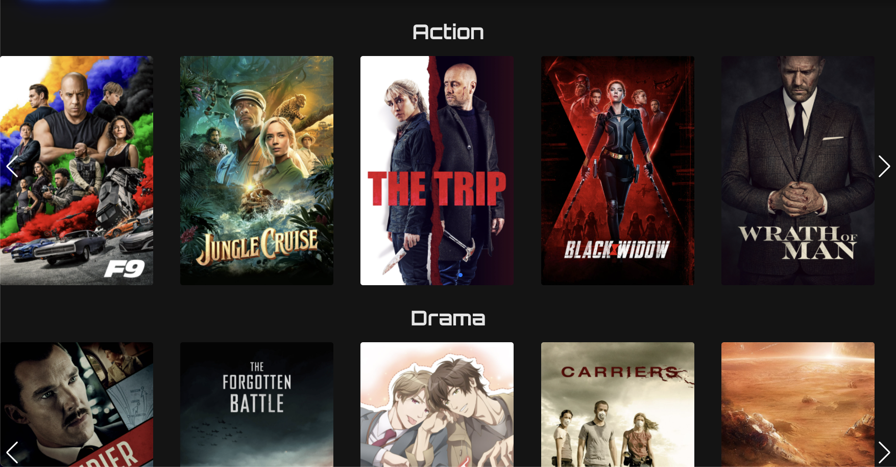
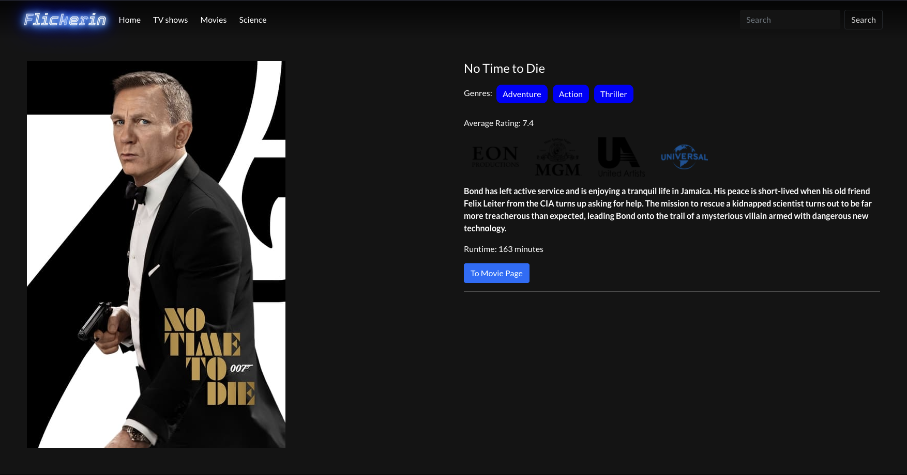
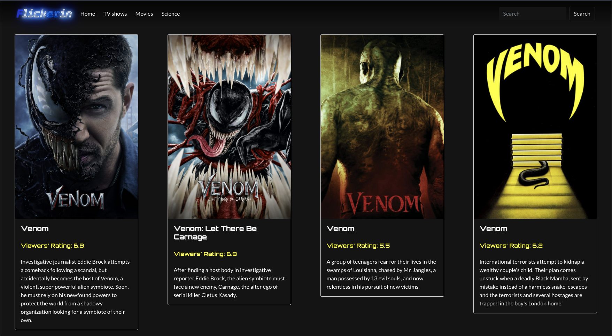

# React Project: Flickerin 

> This project is to create a front-end react website utilizing public APIs. The API used to create "Flickerin" is: [IMDB](https://developer.imdb.com/). 
>
><strong>Abstract:</strong><em> "Flickerin" is a website making movies suggestions for viewers around the globe with the latest and hottest movies selections across different movie genres currently in the box office worldwide;</em>

## File Structure
```
|- flickerin-imdb/src
    |- Components
        |- Hero
            |- Hero.css
            |- Hero.js
        |- MovieList
            |- MovieList.css
            |- MovieList.js
        |- NavBar
            |- NavBar.css
            |- NavBar.js
    |- Pages
        |- HomePage
            |- HomePage.css
            |- HomePage.js
        |- MoviePage
            |- MoviePage.css
            |- MoviePage.js
            |- Youtube.js
        |- SearchPage
            |- SearchPage.css
            |- SearchPage.js
    |- App.css
    |- App.js
    |- FetchApi.js
    |- index.js
```

## UI Layout:
* HomePage Banner

* HomePage Movie List with Carousel display

* Movie Detail Page

* Search Result Page

## Feature Overview:
- User are welcomed to a rich landing page with a cover-sized banner of a randomly selected trending movie;
- User can see movie selections in form of carousel below the banner and can click on slider buttons to get more movie selections in 5 different categories;
- User can click on each movie poster to go to each movie detail page;
- User can view in-detail information about a movie clicked in the detail page and watch that movie trailer;
- User can search for any movie name in the navigation bar's search box and will be taken to the search page displaying all the results matching user's search input;

## Installation: 
- Clone this repo;
- Run

## Technologies:
Project is created with:
* HTML
* CSS
* React JS
* React Bootstrap
* React Router Dom
